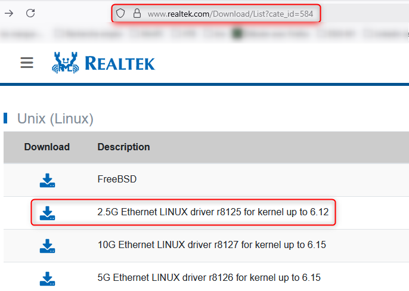

# proxmox-driver-r8125

Pour mes besoins personnel de virtualisation et de formation autodidacte, j'ai acheté un MiniForum MS-A1 avec une jolie configuration:
- AMD Ryzen 9 16C/32T
- 64 Go RAM DDR5
- 2 To de SSD NVMe

Problème, la carte Realtek embarquée n'est pas reconnue par Proxmox à l'installation.

Verion de Proxmox et kernel:
```sh
root@pve:~# pveversion
pve-manager/8.4.0/ec58e45e1bcdf2ac (running kernel: 6.8.12-9-pve)
```

Ainsi, comment installer le driver Linux pour cette carte réseau Realtek 2.5 ?
Le driver à télécharger sur le site officiel de Realtek:
https://www.realtek.com/Download/List?cate_id=584
)


Problématique:
- s'assurer que le driver persiste après une mise à jour du kernel.
- garantir le maintien en condition opérationnel (MCO) et la disponibilité des services virtualisés.


Proxmox VE 8 reconnaissant le driver Ethernet de mon Laptop, j'ai décidé de démarrer Proxmox sur ce dernier avec une connexion filaire, en démarrant sur le SSD du Miniforum.

Voici le script d'automatisation